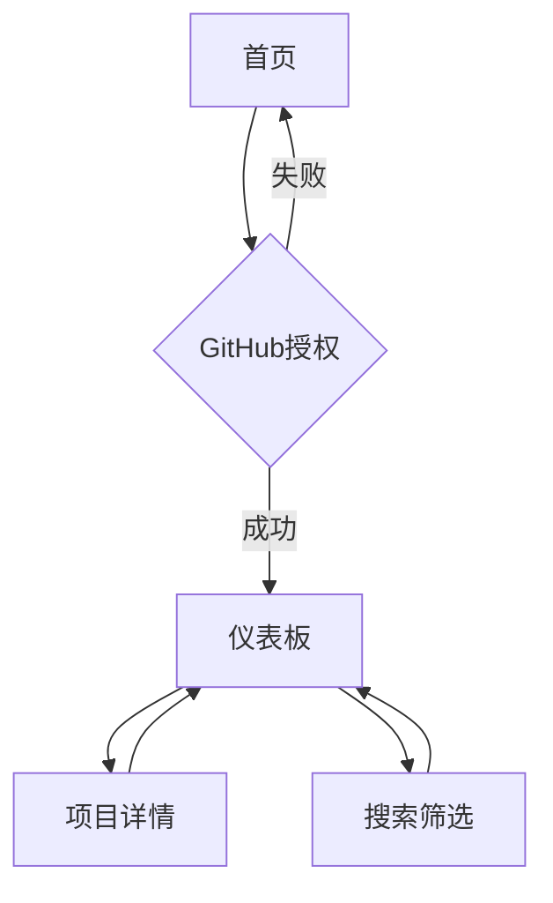

## 1. 产品概述
GitHub Stars解析网站是一个帮助用户可视化和管理GitHub收藏项目的在线平台。用户通过GitHub授权登录后，可以获取并查看自己所有的star和fork数据，以美观的列表形式展现。

该工具解决了开发者难以有效管理和浏览大量GitHub收藏项目的问题，为开发者提供了一个简洁、现代的项目管理界面。

## 2. 核心功能

### 2.1 用户角色
| 角色 | 注册方式 | 核心权限 |
|------|----------|----------|
| 普通用户 | GitHub OAuth授权登录 | 查看个人star/fork数据、搜索筛选项目、导出数据 |

### 2.2 功能模块
本网站包含以下核心页面：
1. **首页**: 欢迎介绍、GitHub登录入口、功能特色展示
2. **仪表板**: 数据总览、项目列表、搜索筛选、排序功能
3. **项目详情**: 项目信息展示、访问链接、统计图表

### 2.3 页面详情
| 页面名称 | 模块名称 | 功能描述 |
|-----------|-------------|-------------|
| 首页 | Hero区域 | 展示网站核心价值和主要功能，包含醒目的GitHub登录按钮 |
| 首页 | 功能介绍 | 展示产品特色，包括数据可视化、智能筛选等功能亮点 |
| 仪表板 | 数据总览 | 显示star总数、fork总数、最近活动、项目分类统计 |
| 仪表板 | 项目列表 | 以卡片形式展示所有star/fork项目，包含项目名称、描述、语言、星标数 |
| 仪表板 | 搜索筛选 | 支持按名称、语言、时间范围、星标数等条件筛选项目 |
| 仪表板 | 排序功能 | 可按名称、星标数、更新时间等维度排序 |
| 项目详情 | 项目信息 | 展示项目完整信息，包括README预览、贡献者、语言分布 |
| 项目详情 | 统计图表 | 显示项目star增长趋势、fork趋势等可视化图表 |

## 3. 核心流程
用户操作流程如下：
1. 用户访问首页，点击"使用GitHub登录"按钮
2. 系统跳转至GitHub授权页面，用户确认授权
3. 授权成功后返回仪表板，自动获取并展示用户star/fork数据
4. 用户可以在仪表板浏览、搜索、筛选项目
5. 点击具体项目可查看详细信息

## 4. 用户界面设计

### 4.1 设计风格
- **主色调**: GitHub风格深灰色(#24292e)配合亮蓝色(#0366d6)
- **辅助色**: 白色背景，浅灰色(#f6f8fa)卡片背景
- **按钮样式**: 圆角矩形，悬停效果，主要按钮使用渐变色
- **字体**: 系统字体栈，标题16-24px，正文14px
- **布局风格**: 卡片式布局，响应式网格系统
- **图标风格**: 使用GitHub官方图标和简洁线条图标

### 4.2 页面设计概览
| 页面名称 | 模块名称 | UI元素 |
|-----------|-------------|-------------|
| 首页 | Hero区域 | 深色渐变背景，居中标题和副标题，大号GitHub登录按钮，简约现代风格 |
| 仪表板 | 数据总览 | 四栏统计卡片，显示关键指标数字，使用图标和简洁排版 |
| 仪表板 | 项目列表 | 网格布局卡片，每张卡片包含项目头像、名称、描述、语言标签、星标数 |
| 项目详情 | 项目信息 | 顶部项目概览，下方README内容区域，侧边栏显示项目统计 |

### 4.3 响应式设计
采用桌面端优先的设计策略，确保在大屏幕上提供最佳体验。同时适配平板和手机端：
- 桌面端：1200px以上宽度，多列网格布局
- 平板端：768px-1199px，双列或单列布局
- 手机端：小于768px，单列布局，优化触摸交互

### 4.4 交互动效
- 页面切换使用平滑过渡动画
- 卡片悬停时有轻微上浮效果
- 数据加载使用骨架屏和渐进式加载
- 搜索筛选实时响应，无需刷新页面