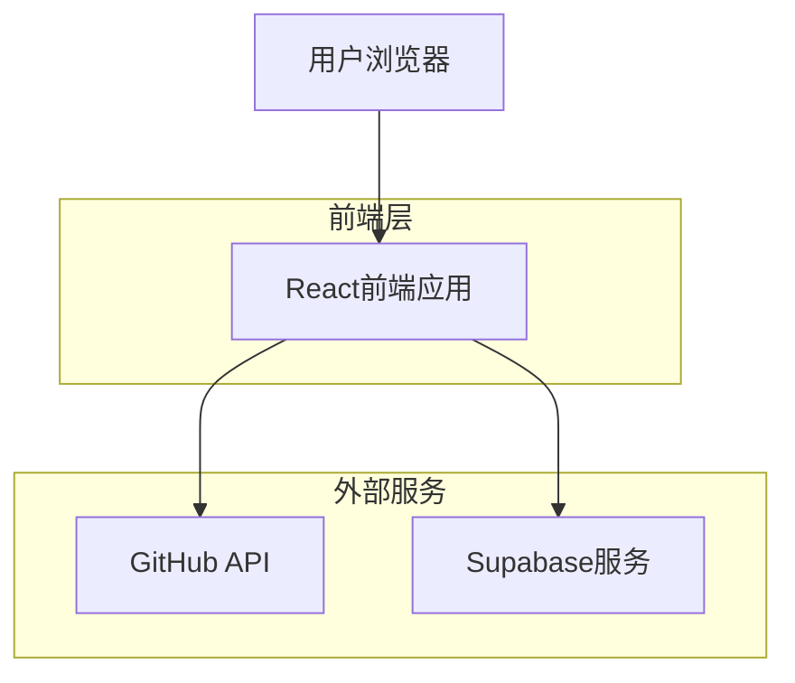
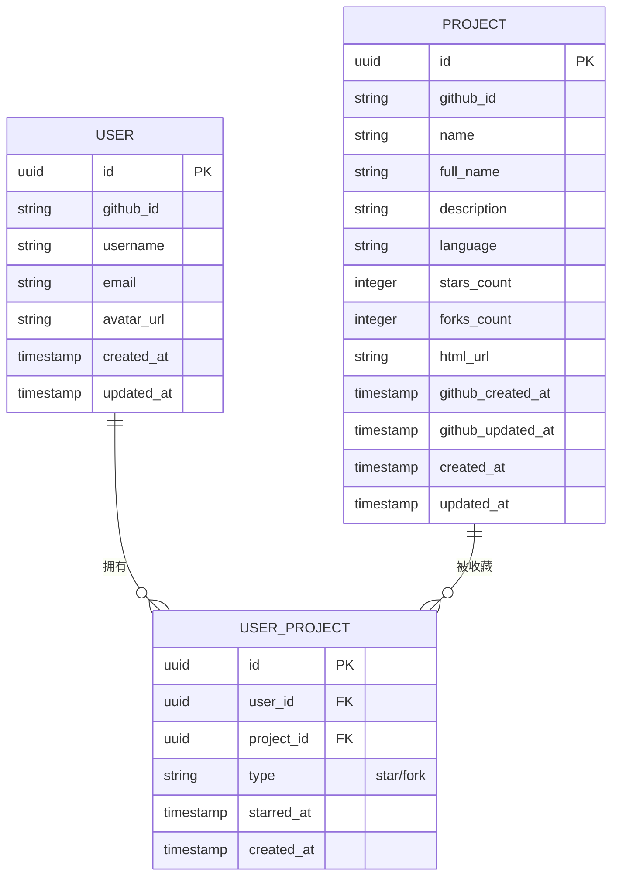

## 1. 架构设计



## 2. 技术栈描述

- **前端**: React@18 + tailwindcss@3 + vite
- **初始化工具**: vite-init
- **认证服务**: Supabase Auth (集成GitHub OAuth)
- **数据存储**: Supabase Database (PostgreSQL)
- **核心依赖**: 
  - @supabase/supabase-js (Supabase客户端)
  - react-router-dom (路由管理)
  - axios (HTTP请求)
  - lucide-react (图标库)
  - recharts (数据可视化)

## 3. 路由定义

| 路由 | 用途 |
|-------|---------|
| / | 首页，展示产品介绍和GitHub登录入口 |
| /dashboard | 仪表板，展示用户star/fork数据总览和项目列表 |
| /project/:id | 项目详情页，展示具体项目的详细信息和统计图表 |
| /auth/callback | GitHub OAuth回调处理页面 |

## 4. 数据模型

### 4.1 数据模型定义



### 4.2 数据定义语言

用户表 (users)
```sql
-- 创建用户表
CREATE TABLE users (
    id UUID PRIMARY KEY DEFAULT gen_random_uuid(),
    github_id VARCHAR(50) UNIQUE NOT NULL,
    username VARCHAR(100) NOT NULL,
    email VARCHAR(255),
    avatar_url TEXT,
    created_at TIMESTAMP WITH TIME ZONE DEFAULT NOW(),
    updated_at TIMESTAMP WITH TIME ZONE DEFAULT NOW()
);

-- 创建索引
CREATE INDEX idx_users_github_id ON users(github_id);
```

项目表 (projects)
```sql
-- 创建项目表
CREATE TABLE projects (
    id UUID PRIMARY KEY DEFAULT gen_random_uuid(),
    github_id BIGINT UNIQUE NOT NULL,
    name VARCHAR(200) NOT NULL,
    full_name VARCHAR(300) NOT NULL,
    description TEXT,
    language VARCHAR(100),
    stars_count INTEGER DEFAULT 0,
    forks_count INTEGER DEFAULT 0,
    html_url TEXT NOT NULL,
    github_created_at TIMESTAMP WITH TIME ZONE,
    github_updated_at TIMESTAMP WITH TIME ZONE,
    created_at TIMESTAMP WITH TIME ZONE DEFAULT NOW(),
    updated_at TIMESTAMP WITH TIME ZONE DEFAULT NOW()
);

-- 创建索引
CREATE INDEX idx_projects_github_id ON projects(github_id);
CREATE INDEX idx_projects_language ON projects(language);
CREATE INDEX idx_projects_stars_count ON projects(stars_count DESC);
```

用户项目关联表 (user_projects)
```sql
-- 创建用户项目关联表
CREATE TABLE user_projects (
    id UUID PRIMARY KEY DEFAULT gen_random_uuid(),
    user_id UUID REFERENCES users(id) ON DELETE CASCADE,
    project_id UUID REFERENCES projects(id) ON DELETE CASCADE,
    type VARCHAR(20) CHECK (type IN ('star', 'fork')),
    starred_at TIMESTAMP WITH TIME ZONE,
    created_at TIMESTAMP WITH TIME ZONE DEFAULT NOW(),
    UNIQUE(user_id, project_id, type)
);

-- 创建索引
CREATE INDEX idx_user_projects_user_id ON user_projects(user_id);
CREATE INDEX idx_user_projects_project_id ON user_projects(project_id);
CREATE INDEX idx_user_projects_type ON user_projects(type);
```

### 4.3 权限设置
```sql
-- 基本访问权限
GRANT SELECT ON users TO anon;
GRANT SELECT ON projects TO anon;
GRANT SELECT ON user_projects TO anon;

-- 认证用户权限
GRANT ALL PRIVILEGES ON users TO authenticated;
GRANT ALL PRIVILEGES ON projects TO authenticated;
GRANT ALL PRIVILEGES ON user_projects TO authenticated;
```

## 5. API集成

### 5.1 GitHub API集成
- **用户认证**: 使用GitHub OAuth获取访问令牌
- **获取用户star项目**: GET /user/starred
- **获取用户fork项目**: GET /user/repos?type=forks
- **获取项目详情**: GET /repos/{owner}/{repo}
- **速率限制**: 每小时5000次请求（认证用户）

### 5.2 数据处理流程
1. 用户首次登录时，批量获取所有star/fork数据
2. 数据经过去重、格式化后存储到Supabase
3. 后续访问优先从本地数据库读取，减少API调用
4. 定期同步机制更新数据（每日或用户手动刷新）

## 6. 性能优化

### 6.1 前端优化
- 使用React.lazy实现代码分割
- 虚拟滚动技术处理大量项目列表
- 图片懒加载和缓存策略
- 使用React.memo减少不必要的重渲染

### 6.2 数据优化
- 分页加载，每页显示20-50个项目
- 本地缓存常用数据（localStorage）
- 增量更新机制，只同步变更的数据
- 数据库索引优化查询性能